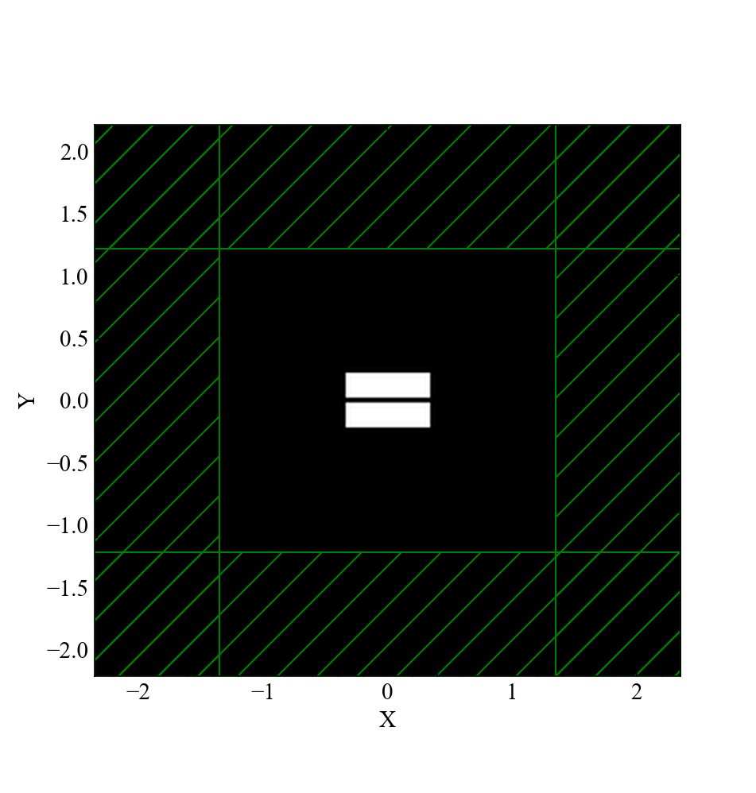
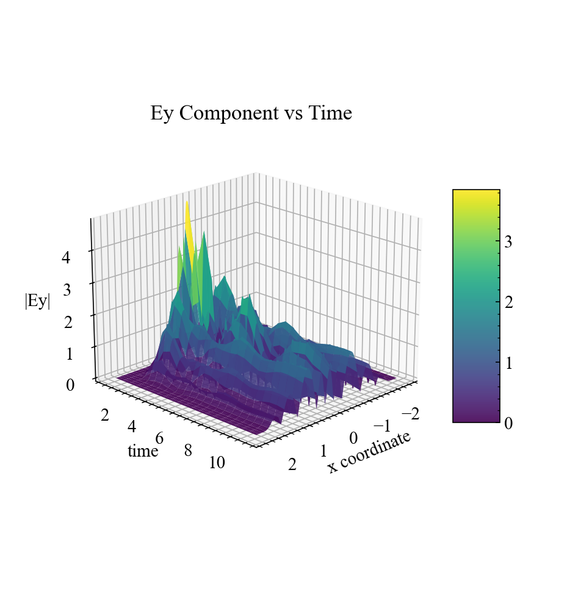

# MEEP split-bar antenna

This repository contains the design and simulation files for a split-bar antenna using MEEP.

## Overview
A split-bar antenna design with electromagnetic simulations and analysis.

> **Note:** This project is currently a work in progress.

## Simulations

### Cell Structure

### Antenna Design

### Field Magnitude

## Getting Started
Clone the repository and explore the simulation files to get started with the antenna design.

